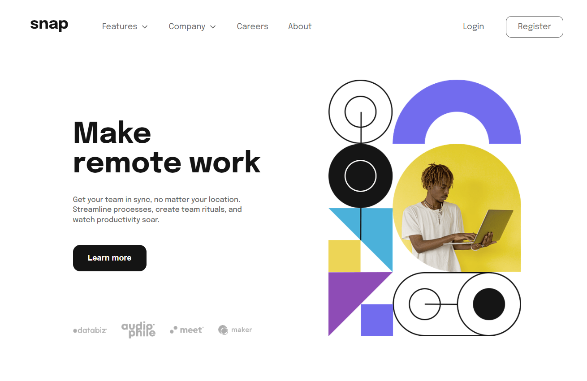

# Frontend Mentor - Intro section with dropdown navigation solution

This is a solution to the [Intro section with dropdown navigation challenge on Frontend Mentor](https://www.frontendmentor.io/challenges/intro-section-with-dropdown-navigation-ryaPetHE5). Frontend Mentor challenges help you improve your coding skills by building realistic projects.

## Table of contents

- [Overview](#overview)
  - [The challenge](#the-challenge)
  - [Screenshot](#screenshot)
  - [Links](#links)
- [My process](#my-process)
  - [Built with](#built-with)
  - [What I learned](#what-i-learned)
  - [Continued development](#continued-development)
  - [Useful resources](#useful-resources)
- [Author](#author)

## Overview

### The challenge

Users should be able to:

- View the relevant dropdown menus on desktop and mobile when interacting with the navigation links
- View the optimal layout for the content depending on their device's screen size
- See hover states for all interactive elements on the page

### Screenshot

### Links

- Solution URL: [Add solution URL here](https://your-solution-url.com)
- Live Site URL: [Add live site URL here](https://your-live-site-url.com)

## My process

### Built with

- Semantic HTML5 markup
- Flexbox
- CSS Grid
- [IonIcons](https://ionic.io/ionicons) - For svg icons

### What I learned

- I have further solidify my CSS & HTML skills by writing this hero section with a nav header. I had make sure that this webpage looks suitable to any screen sizes and I have included minimal UX animations for smooth user interaction.

- This webpage took me 4 days which was suprising considering how simple the website looks. However, the reason why it took me that long was, I tried to include some complex UX user interaction with animations but I wasn't successful with how it turned out. I always take those failures as a learning experience and I've felt that I have learned alot.

- One last thing that I've learned during my process of making this challenge was, I don't need to start including complex stuff to make things look wonderful. Sure, it would look cool, but as a beginner it consumes a lot of time to create something that is so minimal even users might not notice it. It is much better to create the whole website before adding UX user interactions (basically UI first before UX).

### Continued development

- I think I'm ready to create my first landing page without any course tutorials (just documentations and a little bit of googling, AI might help too) and add that to my portfolio. Soon, I might be able to create my actual website portfolio so I can show it to future potential clients.

- I'll continue focusing on frontend development and I'm actually going to start learning the fundamentals of UI/UX and how to use figma so that not only I'm writing code of the frontend, I wanted to design it too.

## Author

- Frontend Mentor - [@SoftPillow20](https://www.frontendmentor.io/profile/SoftPillow20)
